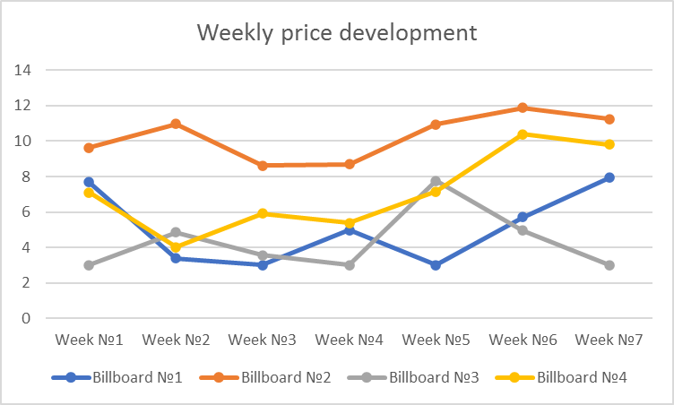
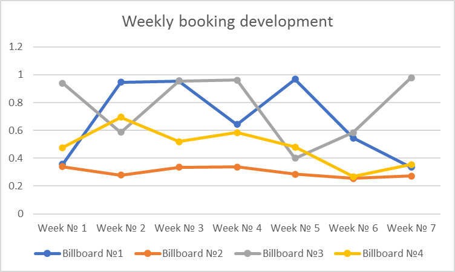
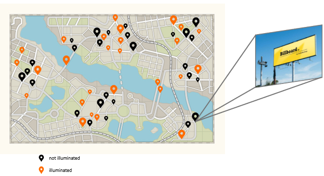

# Final Project of Machine Learning Bootcamp 2024

## Optimal Price Prediction

The Company Bilboardly has 10,000 billboards distributed across the whole country which they give for a rent. Each billboard has its own location, its size, and may be illuminated or not.

Bilboardly sets a daily price for each billboard and saves the data in a weekly wise as following:

For example, if the average daily price for a billboard is 10 Euros and it was booked for 5 out of 7 days in a week, the booking ratio would be 0.71 (5/7). Consequently, the revenue for that billboard that week would be calculated as follows: 10 Euros/day × 7 days × 5/7 (booking ratio)  = 50 Euros as revenue of that billboard for that week.

Bilboardly collected data for each week from 2013 to 2023 (1 year = 52 weeks), which is stored in `data.csv` file that can be accessed via [this Dropbox link](https://www.dropbox.com/scl/fi/saf2go5hjquub552u7ed3/data.csv?rlkey=hqm7b5nfpw91nabuqdls62mtg&dl=0). 

Below you can see the price changes and the booking ratio changes on several billboards during weeks:

> **The company's challenge** is to identify the optimal weekly price for each billboard to maximize the weekly outcome of each billboard based on the provided 10 year dataset.

**Your Task:**
- Develop a neural network based solution to determine the optimal price for each billboard of the first week of 2024. Remember, that your last datapoint is the last week of december 2023 and the first week of 2024 is not included in that dataset.
- Using the data provided in the `benchmark_data.csv` file compute the optimal price for each billboard for the first week of 2024 and save it to the file named `output_benchmark_data.csv`. Please make sure you push the resulting CSV file along with your code (both are necessary!). We will compare your calculated optimal price with our real optimal price and so find out how good your solution is.
- Push your code to GitHub and grant access to the GitHub user @careaware, also send your github link  to the email dev@careaware.eu.
- After completing the task, fill out [this Google Forms](https://docs.google.com/forms/d/e/1FAIpQLSfppKBqzwQONHwGquxzZ-YwlbqQXZfUoWdOk1ZbR3u-a1J_Gw/viewform?usp=sf_link)

**Hints:**

- The optimal price for the billboard is the price at which we will have the maximum revenue of the first week of 2024.
- `benchmark_data.csv` is for accurately verifying the performance of your model.  It has the same structure as `data.csv`, but it includes only 2000 samples. The file can be accessed via [this Dropbox link](https://www.dropbox.com/scl/fi/mtoptfojrval5i4zftnjc/benchmark_data.csv?rlkey=yg6fnz86w6mqlxt8edwkii4h5&dl=0).

- Please ensure that the `output_benchmark_data.csv` retains the same order as the `benchmark_data.csv` to maintain the same order. Your `output_benchmark_data.csv` should be a simple array of length 2000, listing only the optimal prices. Avoid including a complex pandas dataframe. This will allow us to easily match each optimal price with its corresponding billboard.

